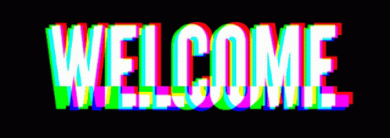

<h1 align="center">Hi 👋, I'm Rakshak Khandelwal</h1>
<h3 align="center">I'm an aspiring back-end developer who's passionate about building scalable and efficient systems. I'm currently learning Node.js as my primary backend technology and working on personal projects to improve my skills.
</h3>

  

  

    

    

<h3 align="left">Connect with me:</h3>

 <h3 align="left">Tools and Editors:</h3>

<h3 align="left">Version Control and Collaboration:</h3>
 
 
 
<h3 align="left">Front-end Development:</h3>
 
<h3 align="left">Back-end Development and Databases: </h3>

<h3 align="left">Web Development Frameworks:</h3>

<h3 align="left">TypeScript</h3>

